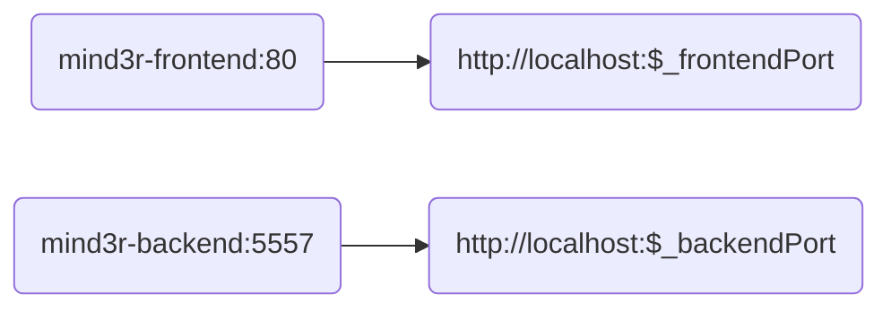

#  Mɪɴᴅɜʀ

### Reminders <!-- markdownlint-disable-line MD001 -->

---

 &nbsp;


---

<!-- ! TODO
### 📷 Screenshot


---
-->

### 🐳 Docker

#### Compose Flow:



#### Building Images:

```bash
./build.sh
```

---

### 📄 Documentation

#### Building:

```bash
./docs.sh
```

#### Links:

- [Frontend](./frontend/README.md "Frontend")
- [Backend](./backend/README.md "Backend")
